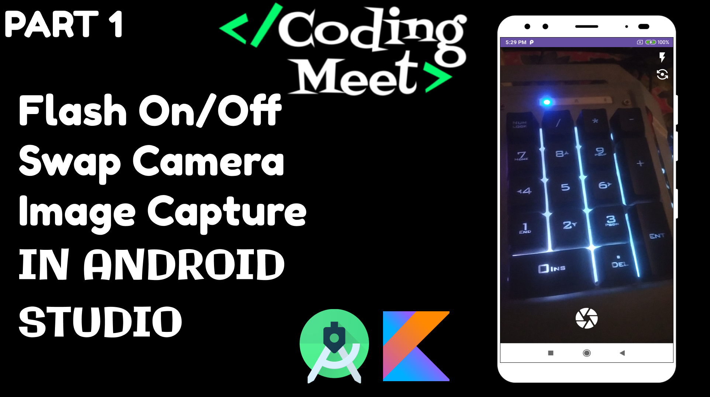
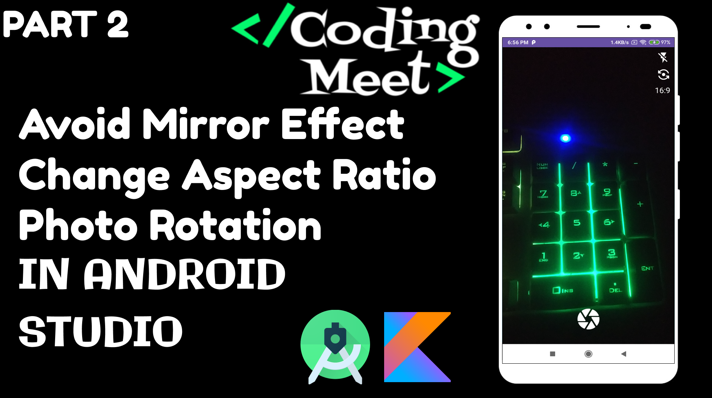
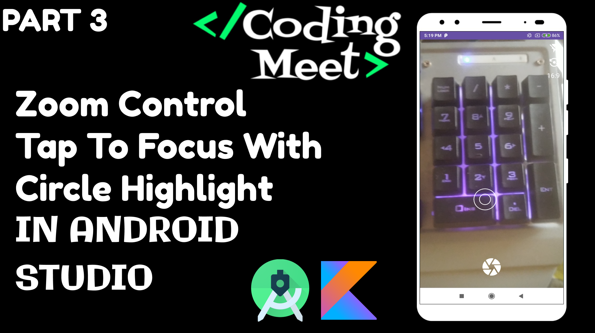
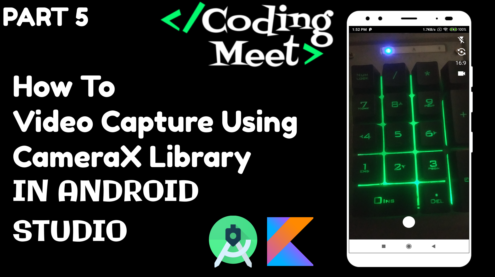
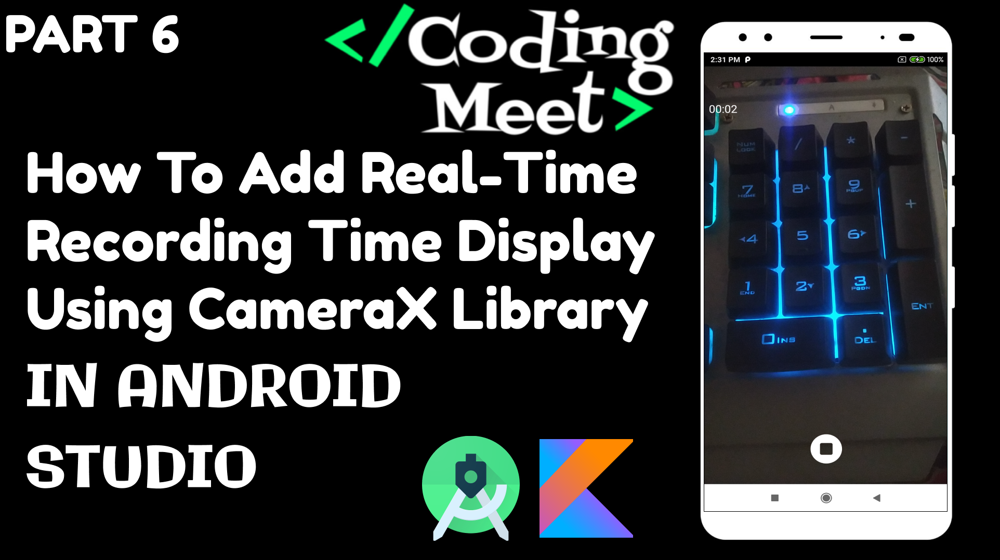

# Camera App Using CameraX Library in Android Studio Kotlin

Welcome to the "Camera App Using CameraX Library in Android Studio Kotlin" YouTube playlist! This playlist is designed to help you master the art of building a feature-rich camera application in Android using the CameraX library. Whether you're a beginner or an experienced developer, this series offers valuable insights into camera app development.

## Video List

### 1. [How to Image Capture using CameraX Library in Android Studio Kotlin](https://youtu.be/r7JbipBL3GM?si=vxbom5UA-3uU_i6V)

Learn how to capture images in your Android app using CameraX library. This video covers the basics of setting up the camera, taking pictures, and saving them.

### 2. [Avoid Mirror Effect | Change Aspect Ratio | Photo Rotation | CameraX Library Kotlin](https://youtu.be/BcNYaFrQDCk?si=QM6ZBV5Il87PeQqk)

Discover how to avoid the mirror effect, change aspect ratios, and rotate photos captured with CameraX. This video is packed with tips and tricks for enhancing your camera app.

### 3. [Zoom Control | Tap to Focus with Circle Highlight | CameraX Library | Android Kotlin](https://youtu.be/KxfeLraYIgY?si=TWQX4mIl9aaaCDuo)

Explore advanced camera features, including zoom control and tap-to-focus with circle highlighting. Elevate your camera app with these interactive functionalities.

### 4. [Image Capture Bug on Android 13 | CameraX Library | Android Studio | Kotlin](https://youtu.be/0Ot2jVLaNbY?si=zCfFEAdYL5AmNczv)

Address image capture bugs specific to Android 13 using CameraX library. This video provides solutions and workarounds for a smoother experience.

### 5. [How to Video Capture using CameraX Library in Android Studio Kotlin](https://youtu.be/EL94sWx1DYo?si=rrBBo2k50ZFcCRTQ)

Dive into video recording capabilities in your Android app. Learn how to capture high-quality videos using the CameraX library.

### 6. [How to Add Real-time Recording Time Display using CameraX in Android Studio Kotlin](https://youtu.be/e_7miNfNGCg?si=AUWjyFZiDxRH9eQ3)

Implement real-time recording time display in your camera app. This engaging feature enhances the user experience.

## Get Started

To get started, watch the video that interests you and follow the accompanying code in this repository. We hope you enjoy this playlist and find it helpful in your camera app development journey.

Don't forget to like, share, and subscribe for more Android development tutorials and updates. If you have any questions or feedback, please leave a comment on the video or reach out to us.

Happy coding!

---

## Support the Project

If you find this tutorial series helpful and would like to support the development of more content, consider buying me a coffee! Your support helps in creating high-quality tutorials.

Your generosity is greatly appreciated! Thank you for supporting this project.

---

[Subscribe to Our YouTube Channel](https://www.youtube.com/@CodingMeet26)
